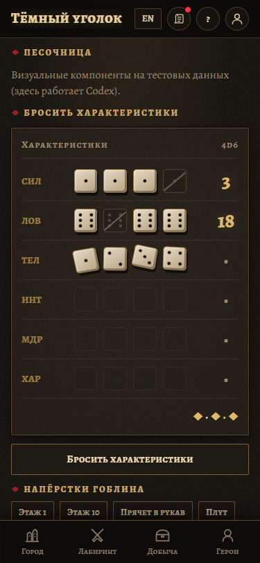
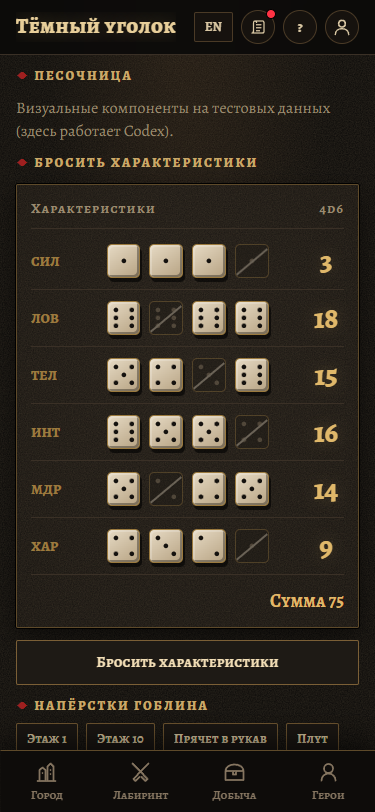
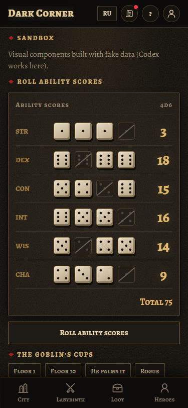
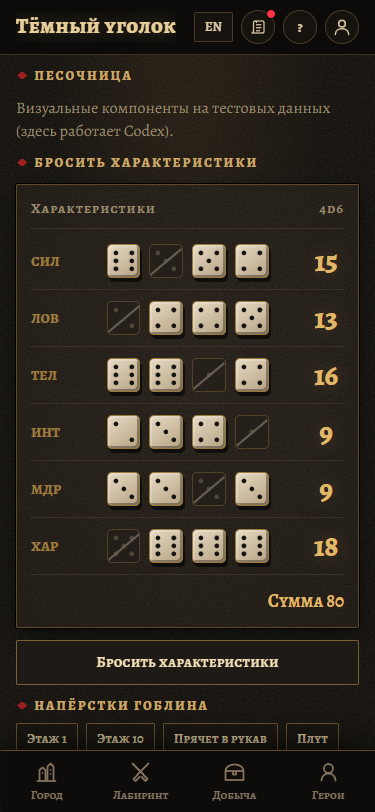
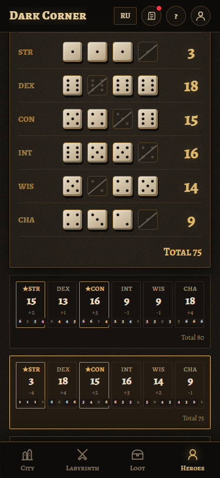
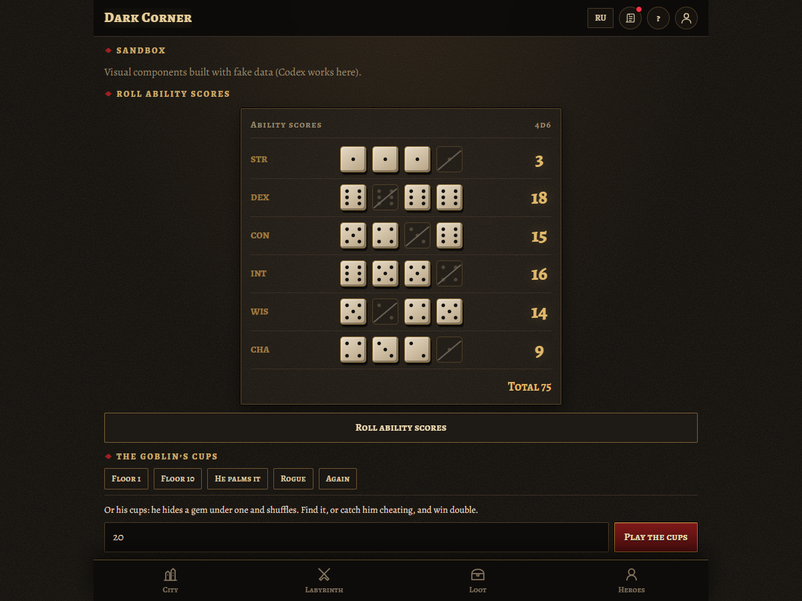

# Ability dice — evidence only

Do not merge this branch. Implementation: `codex/ability-dice`, `44cd7f6`.

[Short recording: both fixture sets, replacement, reduced motion and Hero creation](dice-reveal.webm).

| Phone, 375 × 812 | Result |
|---|---|
| Dice tumble in Russian |  |
| Recorded result, Russian |  |
| Recorded result, English |  |
| Reduced motion |  |
| Reroll in Hero creation, keeping both sets |  |
| Desktop |  |

The browser check verifies the six supplied totals and six dropped dice, replacement during a reveal, reduced motion and toggling it after completion, and no overflow or browser errors. Hero creation is exercised against mocked draft API responses: two requests, Next disabled during the reveal, and both sets retained after reroll. A separate StrictMode mount check verifies onDone once, callback replacement, reduced motion and cleanup on unmount.

Root typecheck/build and tests pass (186 API, 61 web, 306 engine). First-load entry remains 515.85 kB / 169.81 kB gzip, and CSS remains 48.48 kB / 10.52 kB gzip. The dice styles travel with the lazy Heroes component.
