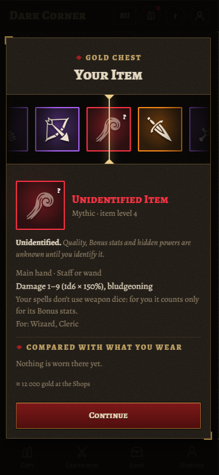
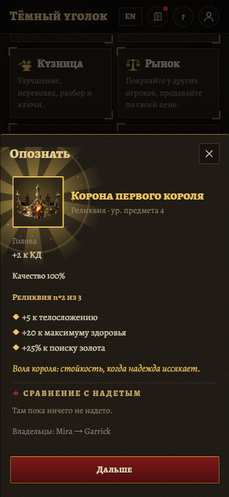
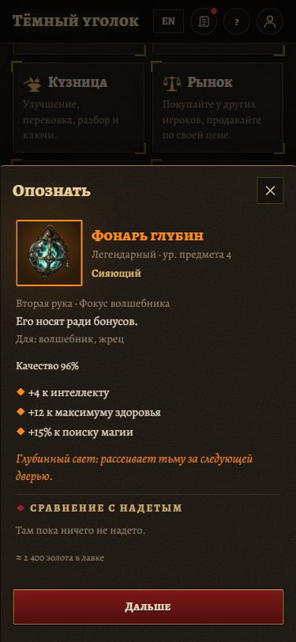

# Chest Spin review evidence

**Never merge `codex/chest-spin-evidence`.** This branch archives media only. The implementation is `codex/chest-spin`, commit `172c85c`, based on main `6c365da`. None of these recordings or screenshots is in its commit history.

## Recordings

375 × 812, desktop Chrome, English, normal motion. Silent 25 fps recordings demonstrate the presentation; they do not measure phone performance.

- [Iron Chest](iron.webm)
- [Gold Chest landing on an Unidentified Mythic](gold.webm)
- [Relic identify reveal](relic.webm)





## Behavior

- A 4.4 second strip follows the supplied Chest odds and stops on the exact server prize. Cosmetic decoys never boost rare Tiers or invent near-misses. Unidentified prizes retain their question mark and concealed fields.
- Identification breaks the seal, then reveals the name, Quality, each Bonus stat and power in sequence. The completed card keeps the existing gear facts and comparison. Radiant adds a shimmer.
- Common has no burst. Higher Tiers add glow, sparks, beams and rings; Mythic and Relic shake the scene. The existing sound module controls Tier cues and Android vibration, including mute.
- Skip displays the result immediately and waits for Continue. Reduced motion bypasses the sequence and replaces particles and shake with a static glow. Preference changes during a Spin are observed.
- The Chest dialog traps keyboard focus, supports Escape (show result, then dismiss) and restores focus. Animation frames and reveal timers are cleaned up when scenes close.
- Production entry points: Loot Chest opening and identifying, Heroes identifying, and Labyrinth report drops. Their server requests remain authoritative.

## Validation

- `npm run typecheck`: passes across all workspaces.
- `npm run build`: passes across all workspaces; final CSS adjustment also passes the web build.
- `npm run test -w @dark/web`: four passing tests covering schema-valid fixtures, an unchanged server prize, exact supplied weight proportions, and zero/missing weights.
- `node scripts/check-loot.cjs`: 24 scene/language/motion combinations (three Chests and three reveals × English/Russian × normal/reduced), at 375 px. Every Tier, exact needle alignment, early Skip, repeated opening/closing, focus restoration, Escape, motion preference changes and horizontal layout pass.
- Real Loot and Heroes components pass opening/identifying flows with stubbed API responses. Labyrinth reports show Tier bursts and open Item details. Desktop layout and one Mythic vibration per reveal pass; mute suppresses vibration. See [browser-checks.json](browser-checks.json).
- Screenshots inspected in both languages. [Desktop prize](gold-desktop.png), [Russian Iron Chest](iron-ru-no-preference.png).

Physical mid-range phone smoothness remains unmeasured. A live server Chest/identify action was not exercised; network responses were stubbed for these checks.

## Reproduce

On the implementation branch, start the Vite server on port 5187. With Playwright and Chrome installed, run from `apps/web`:

```sh
node scripts/check-loot.cjs
node scripts/check-loot.cjs --record
```

`PLAYWRIGHT_MODULE` can name an installed Playwright runtime. `LOOT_BASE_URL` changes the server URL and `LOOT_OUTPUT` changes the output directory. By default, generated media goes to the OS temporary directory. Recordings need Playwright's FFmpeg support. Never add generated media to the implementation branch.
