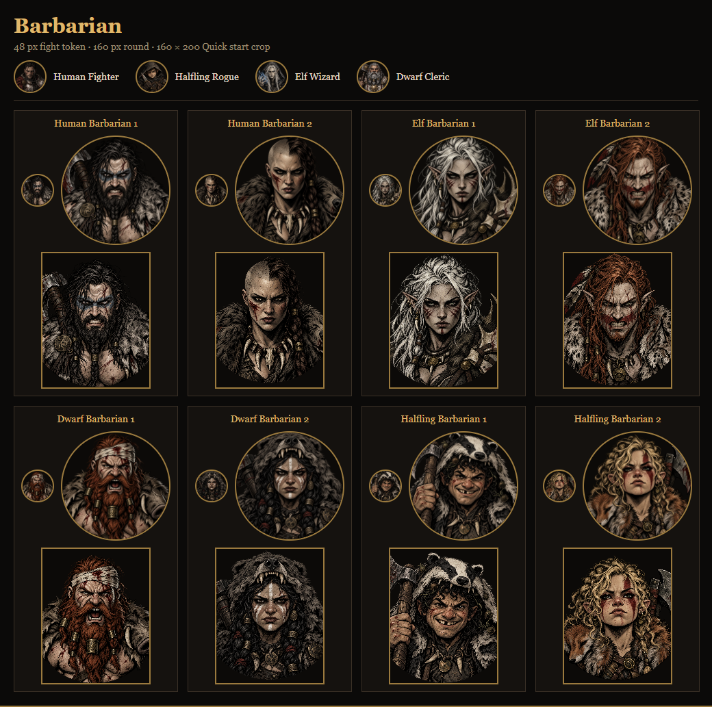
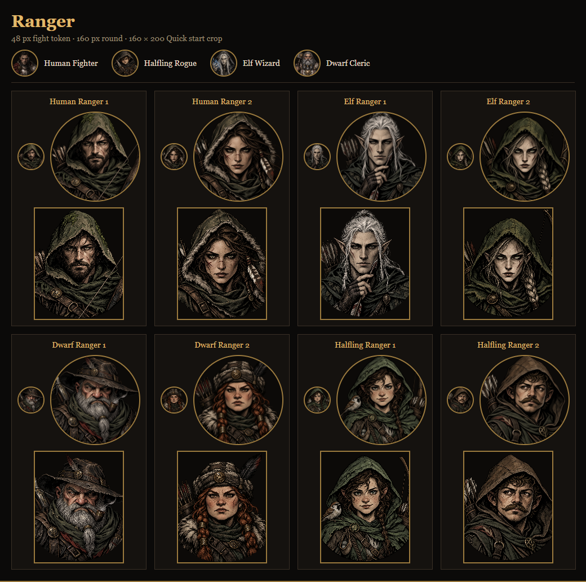
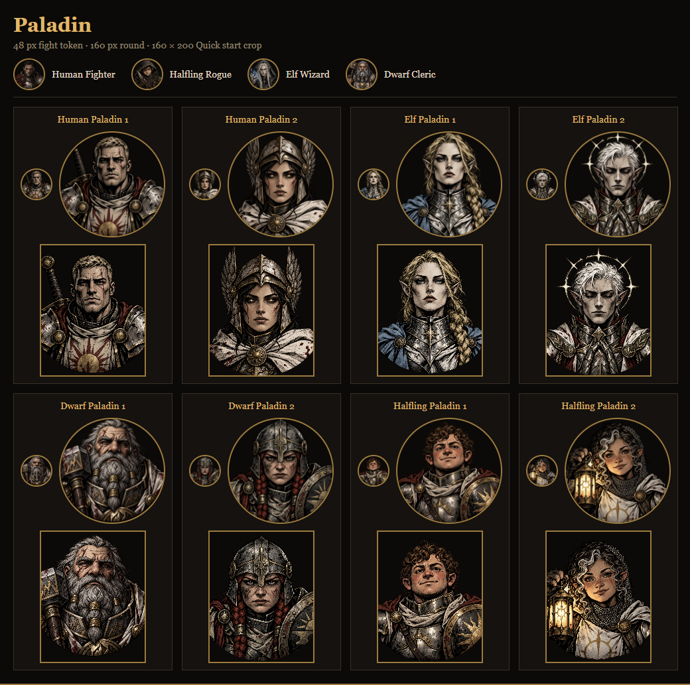
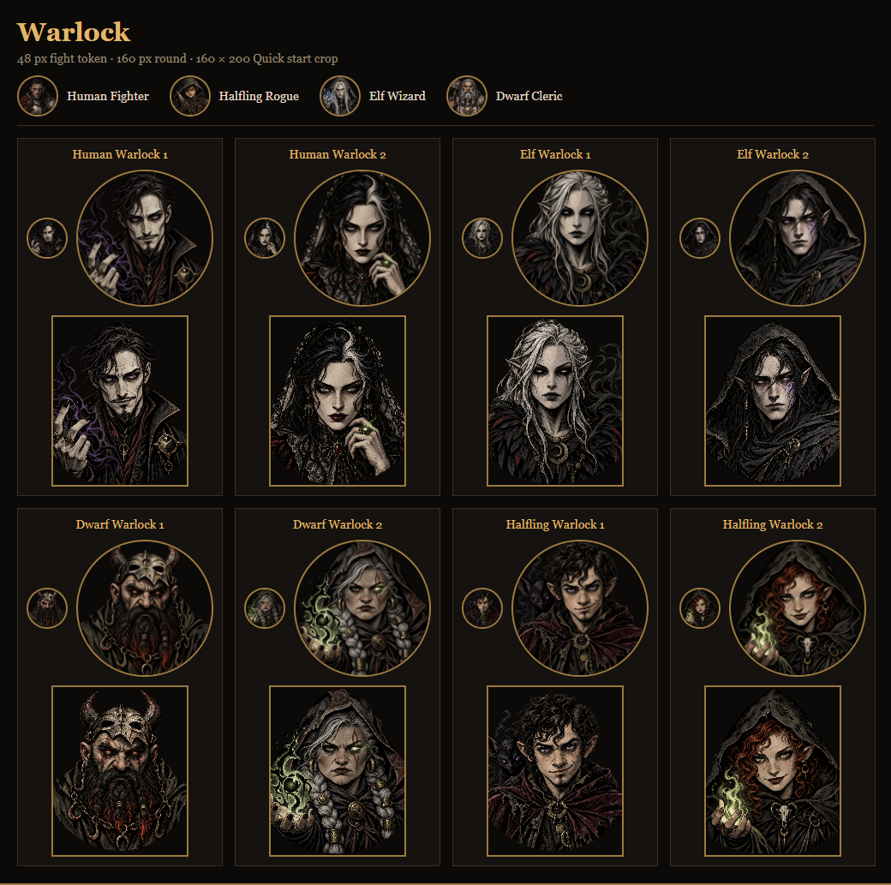
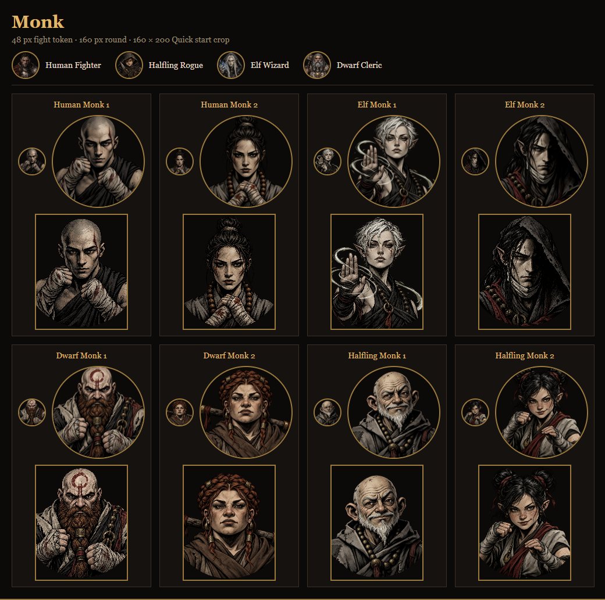
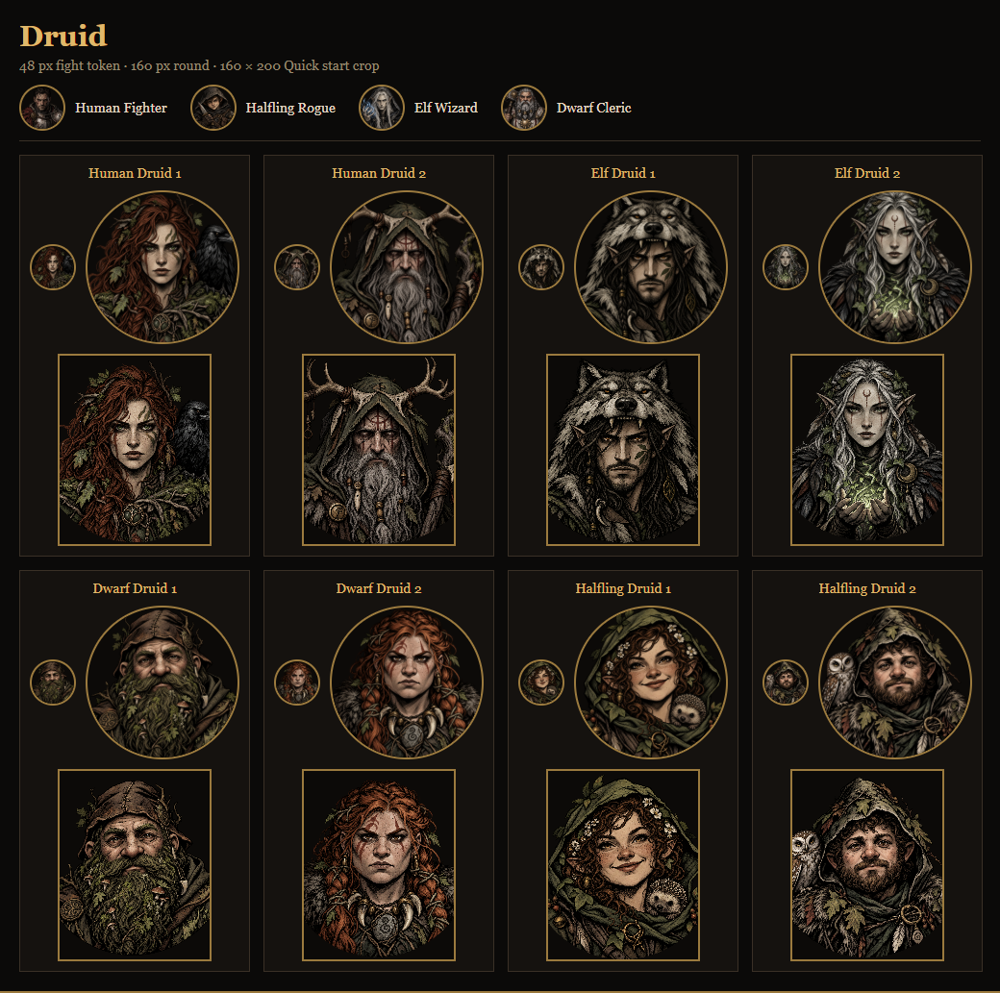
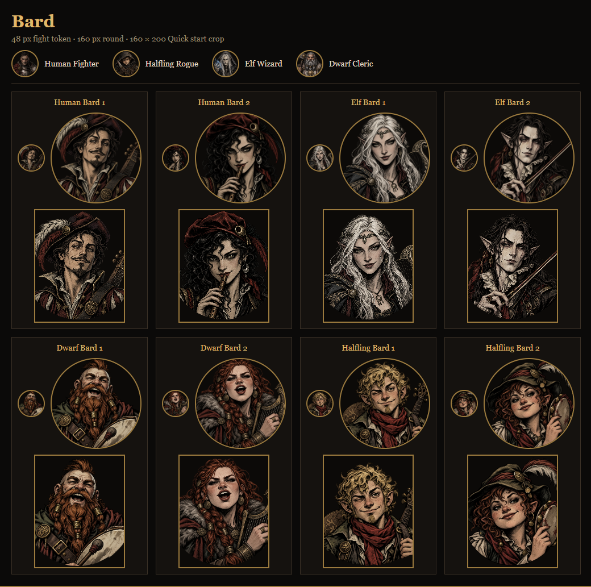
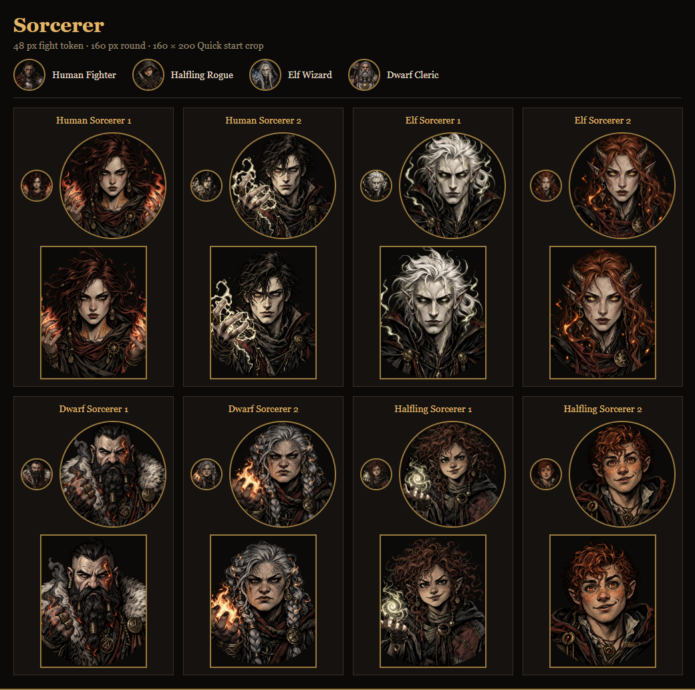

# Class portrait review

Evidence for brief 24; this branch must never merge. Each sheet shows all eight portraits for one Class at 48 px and 160 px round, plus a 160 × 200 Quick start crop. Four existing portraits appear at 48 px above each Class for comparison.

+

All 64 images were inspected in these crops and at source size. Faces remain inside the central circle; Class equipment and silhouettes distinguish the new callings. No source needs a second pass from this review. A final check of the runtime 256 px WebP files remains part of Claude's integration.

Source validation checks all 64 new files are 1254 × 1254 RGBA, with transparent corners, a full alpha range, and byte-for-byte SHA-256 matches to the generator originals. The source PR adds 147.0 MiB and changes no application files or runtime bundle. Exact prompts and validation are in `art/portraits/`; open `review.html` there to reproduce the crop gallery locally.
