# Class power effects — review evidence

Evidence branch only: do not merge this branch. Implementation: `codex/class-power-effects`, commit `e8c3233`.

Captured on `/sandbox` in Chromium at 375 × 812, Russian. Fourteen synthetic, contract-validated Duo replays cover seven Classes from both Players' sides; all 38 real engine fixtures remain unchanged. All seven partner-side replays reached their final frame. Reduced motion, horizontal overflow and browser errors were checked (see `validation.json`).

Root `npm run typecheck`, `npm test` (180 API + 66 web + 306 engine tests), and `npm run build` pass. Tests use an isolated local database. Initial web entry remains 515.85 kB / 169.81 kB gzip; CSS remains 48.48 kB / 10.52 kB gzip. Added rendering lives in the lazy fight stage.

| Power | Phone capture |
|---|---|
| Divine smite | 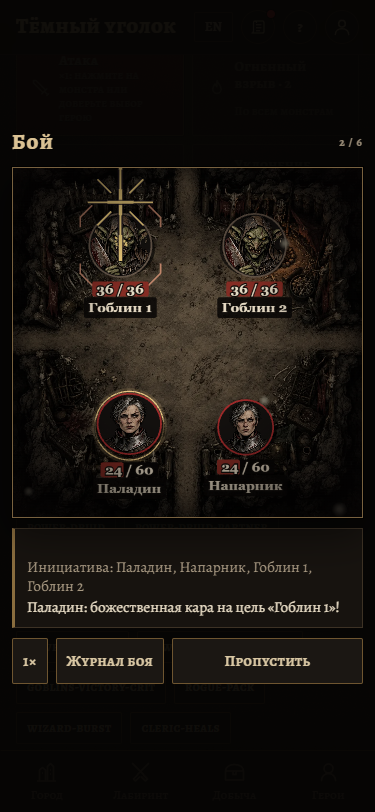 |
| Lay on hands, reaching the Partner | 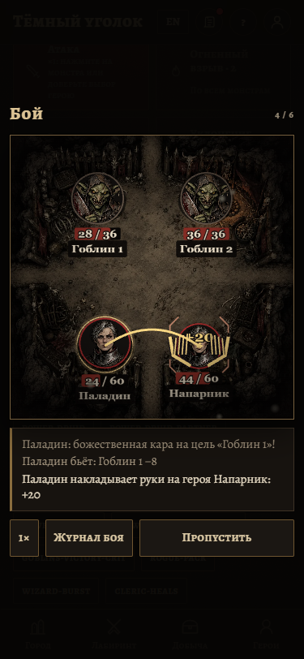 |
| Armor of Agathys | 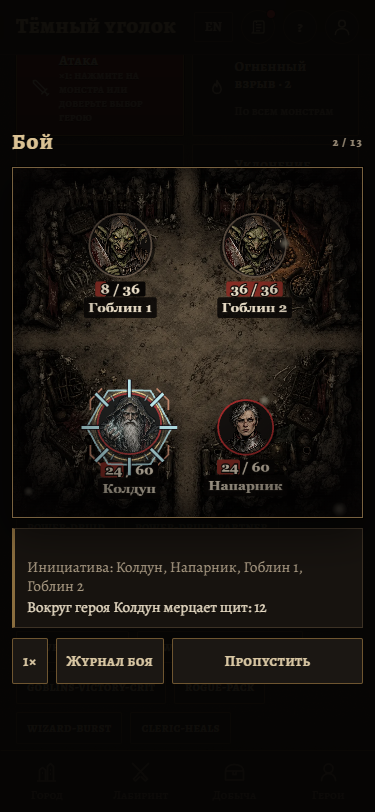 |
| Hex | 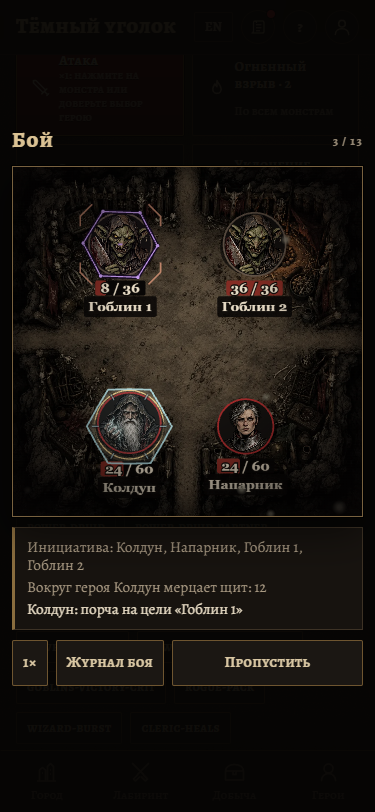 |
| Hex changing targets | 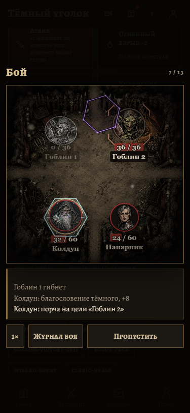 |
| Dark blessing | 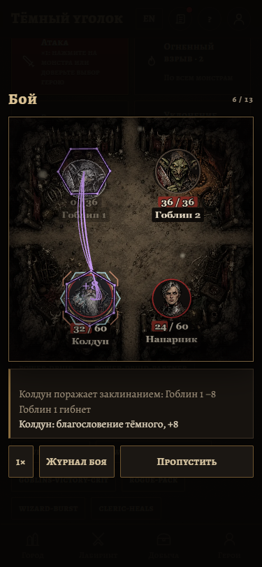 |
| Flurry of blows | 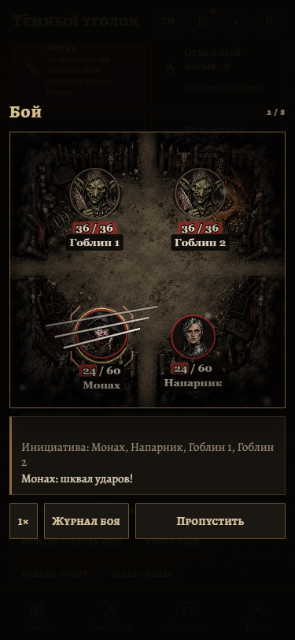 |
| Wholeness of body | 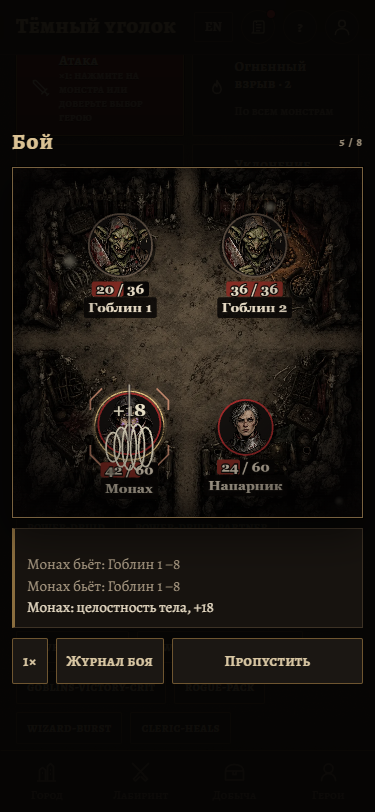 |
| Wild shape | 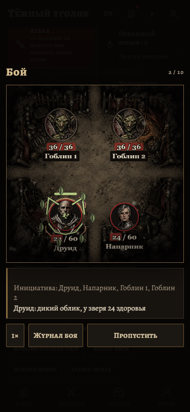 |
| Beast buffer absorbing damage | 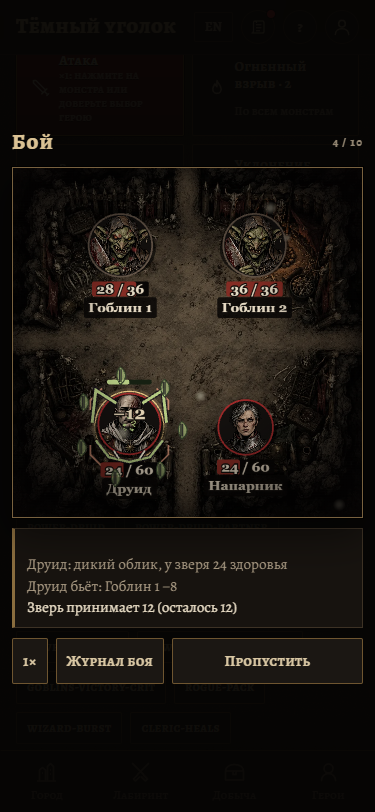 |
| Beast falling away | 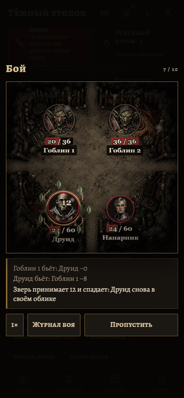 |
| Bardic inspiration | 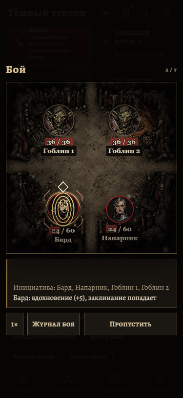 |
| Cutting words | 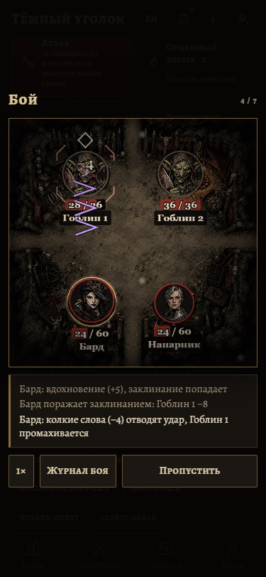 |
| Quickened spells | 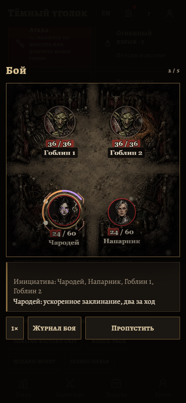 |
| Action Surge | 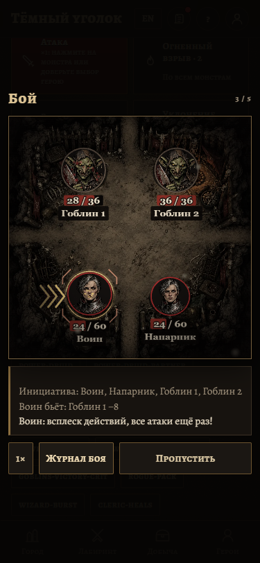 |
| Entropic ward | 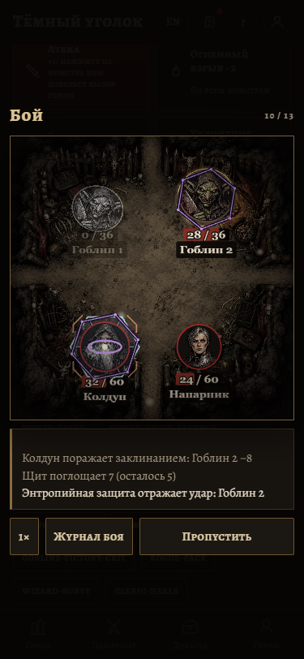 |
| Cloak of shadows | 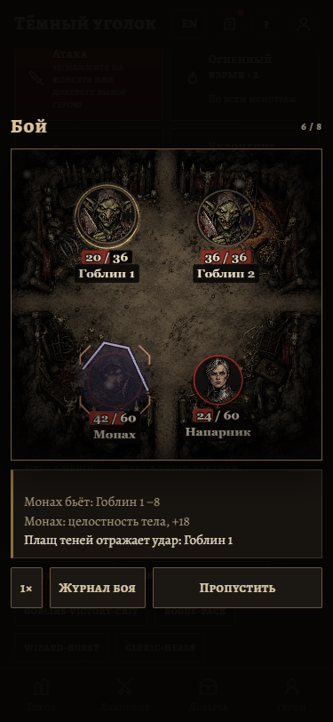 |
| Eldritch beams | 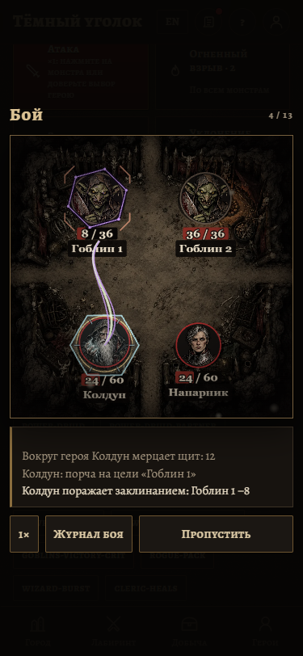 |
| Beast claws | 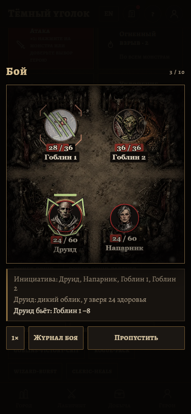 |
| Thorn whip | 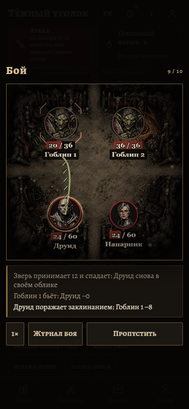 |
| Mockery | 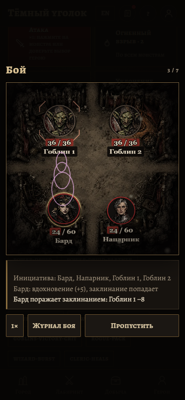 |
| Sorcerer fire | 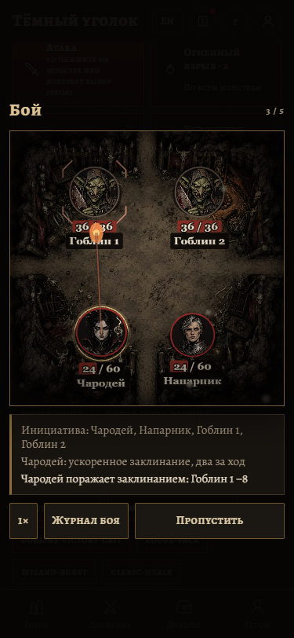 |
| Reduced motion, partner Druid | 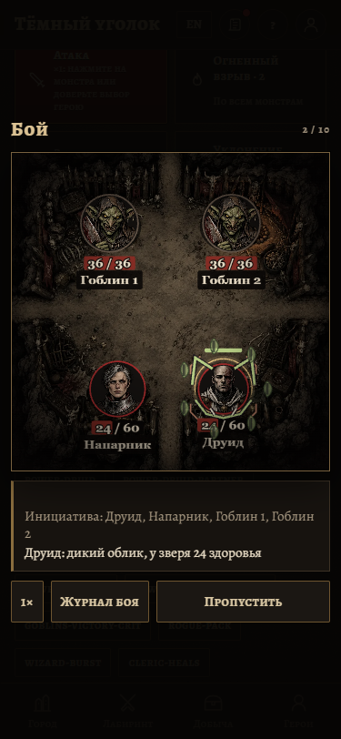 |
