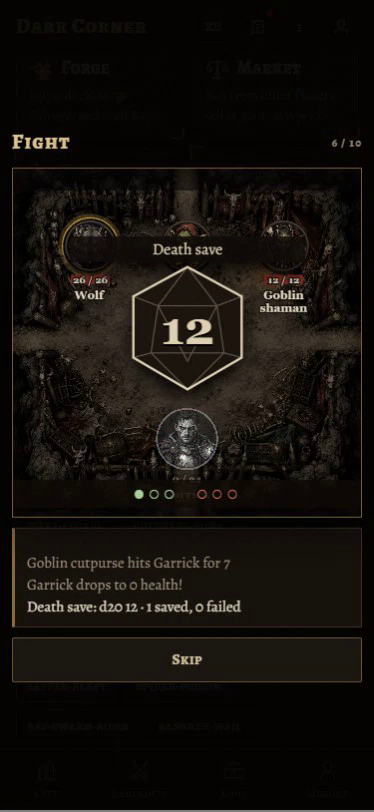

# Fight scene review

Implements [task 03](../../tasks/codex-03-fight-scene.md) on `codex/fight-scene`, based on `7d23a7d`.

`FightScene` replaces the DOM playback in the Labyrinth and Sandbox. The React dialog owns timing, translated narration, dice, keyboard focus and completion. Immutable replay snapshots own recorded health/status values. The dynamically imported Pixi stage owns tokens and transient effects, and releases its renderer, ticker, filters and observer on close. Shared art stays in Pixi's asset cache for subsequent fights.

## Recordings

375 × 812 browser viewport, English, normal motion. The clips seek past earlier events, then play the featured section at normal speed. Recording is 25 fps and is not a performance measurement. Sound was muted during capture.

- [Wizard burst](wizard-burst.webm)
- [Death saves](survived-death-saves.webm)
- [Sapper blast](sapper-blast.webm)
- [Dragon breath](dragon.webm)




## Validation

- `npm run test -w @dark/web`: 8 passing tests covering schema compatibility, coverage of event/power variants, authoritative HP, mend/drain targeting, rerolls/rise, status ticks, escape and recorded dice.
- `npm run typecheck`: passes across all workspaces. The existing local Prisma client first needed regeneration with `npm run postinstall -w @dark/api`; no schema/database changes were made.
- `npm run build`: passes across all workspaces.
- `scripts/check-fights.cjs`: all 23 real replays and two supplemental visual examples complete at 375 px in English/normal motion and Russian/reduced motion. See [browser-checks.json](browser-checks.json).
- Browser checks also cover repeated opening/closing, focus trapping/restoration, Escape, Skip before the graphics import resolves, and HTML fallback when WebGL is unavailable.
- The real Labyrinth React screen passes Fight → playback → Continue → report → Room with stubbed API responses, including a turned Room map. A live server fight was not exercised.
- Screenshots were inspected for phone layout, readable labels, the oversized Dragon, elite colors and missing-token fallback.

### Initial bundle

Vite build output, kB (decimal):

| Initial asset | Before | After | Before gzip | After gzip |
| --- | ---: | ---: | ---: | ---: |
| Main JavaScript | 430.59 | 422.39 | 144.28 | 141.17 |
| Main CSS | 45.58 | 44.41 | 9.90 | 9.78 |

Pixi and its renderer load only when a fight opens. The stage chunk is 331.00 kB / 105.61 kB gzip; renderer support chunks are also deferred. Patch-note contents now load with the News screen, keeping the initial bundle below the baseline despite new translated fight labels.

## Remaining acceptance checks

- **Physical mid-range phone:** 60 fps is not verified. Automated runs use headless desktop Chrome with SwiftShader; viewport emulation is not a substitute for a phone GPU. Effects are bounded, resolution is capped at 2×, and the private ticker stops when idle. Review on an actual phone before calling this criterion complete.
- **Fear expiry contract request for Claude:** `status` provides a duration, but no round/turn-boundary or status-expired event. The engine decrements fear at round end; multiattacks, reactions, skipped turns and pre-round powers prevent reliable reconstruction from attacks. This implementation retains the recorded fear mark until defeat/end. Burning/poison ticks and paralysis's `held` events can expire their marks correctly. Please add a server-emitted status-expiry event (with owner approval for `packages/shared`) and its fixture; the frontend can then remove fear at the authoritative event. No combat rules are simulated in the browser.
- A live server fight should supplement the stubbed-API integration check before release.

## Reproduce browser checks

Start the web dev server on port 5187. Install Playwright/Chrome in the test environment, or point `PLAYWRIGHT_MODULE` at an existing Playwright installation. For recordings, install its FFmpeg support with `playwright install ffmpeg`.

From `apps/web`:

```sh
node scripts/check-fights.cjs
node scripts/check-fights.cjs --record
```

`FIGHT_BASE_URL` and `FIGHT_OUTPUT` override the server URL and output directory. Authentication and Labyrinth endpoints are stubbed only inside these browser contexts.
