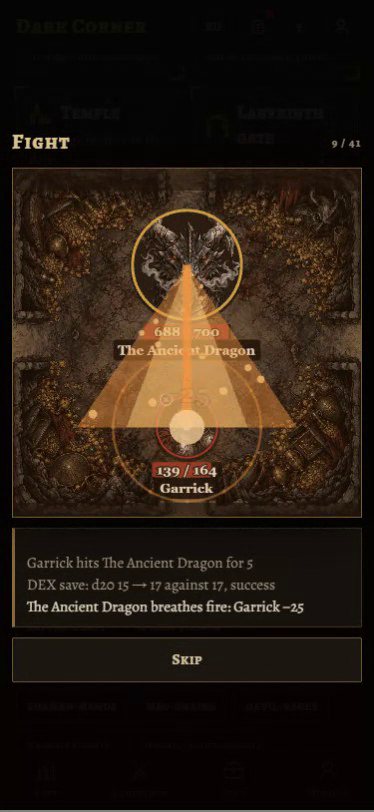
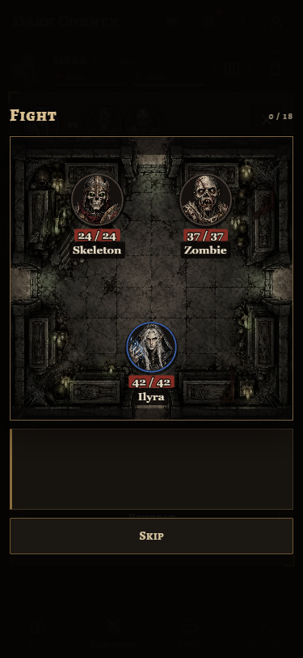
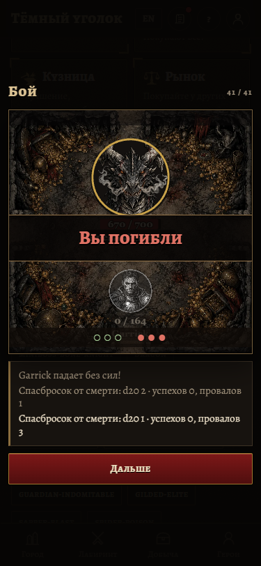

# Fight scene review evidence

This branch is an evidence archive only. **Never merge `codex/fight-scene-evidence`.** Implementation is [PR 6](https://github.com/IkayevAibar/DarkCorner/pull/6), commit `7820154`, rebased on main `6c365da`. No files in this directory are present in the implementation branch's commits.

## Recordings

Updated captures: 375 × 812, English, normal motion. Clips seek past earlier events and play the featured section at normal speed. Silent 25 fps recordings are visual evidence, not performance measurements.

- [Wizard burst](wizard-burst.webm)
- [Death saves](survived-death-saves.webm)
- [Sapper blast](sapper-blast.webm)
- [Dragon breath](dragon.webm)





## Validation

- `npm run test -w @dark/web`: 12 passing tests. All 27 real engine replays and two supplemental visual examples parse, preserve recorded health and cover every event variant. All monster powers have real fixtures. All four statuses wait for `expire`; the real Mummy fixture verifies fear ends mid-fight.
- `npm run typecheck` and `npm run build`: pass across all workspaces. Local Prisma client regenerated; no schema or database changes.
- `scripts/check-fights.cjs`: 58 fixture/locale combinations at 375 px (English/normal and Russian/reduced motion), repeated opening/closing, focus restoration, Escape, Skip during graphics import, and fallback without WebGL. See [browser-checks.json](browser-checks.json).
- Production Labyrinth screen: Fight → replay → report → Room passes with stubbed API responses, including current Deeds fields.
- Owner separately verified a real Labyrinth fight, Wizard burst, death saves and Dragon at 375 px in Russian before the review changes.
- Screenshots inspected for layout and larger labels. Dragon breath now fills a wider cone with an impact ring. Reduced motion omits camera shake and moving particles.
- Physical phone 60 fps remains unmeasured; browser checks use desktop Chrome with SwiftShader.

## Loading

Pixi's chunk preloads on Labyrinth entry; its canvas is created only while a fight is open. Patch-note contents load with the News screen. Current build: main JS 430.55 kB / 143.68 kB gzip; stage 331.61 kB / 105.83 kB gzip. These totals include main's newer content and are not a comparison against the old base.

## Reproduce

Run the implementation branch's web dev server on port 5187, with Playwright and Chrome available. From `apps/web`:

```sh
node scripts/check-fights.cjs
node scripts/check-fights.cjs --record
```

`PLAYWRIGHT_MODULE` can point to an installed Playwright runtime. `FIGHT_BASE_URL` overrides the server URL. Output defaults to the OS temporary directory; set `FIGHT_OUTPUT` to an evidence checkout to save it there. Recordings require Playwright's FFmpeg support. Do not add generated media to the implementation branch.
