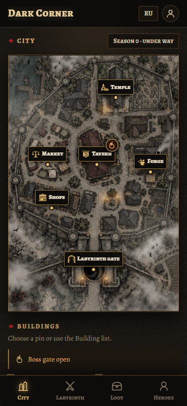
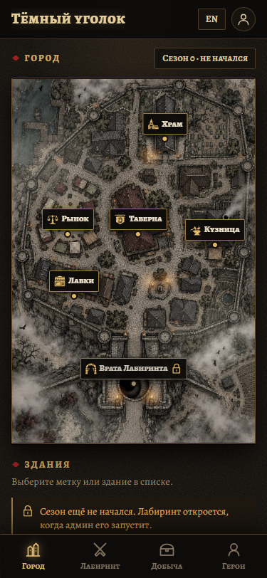
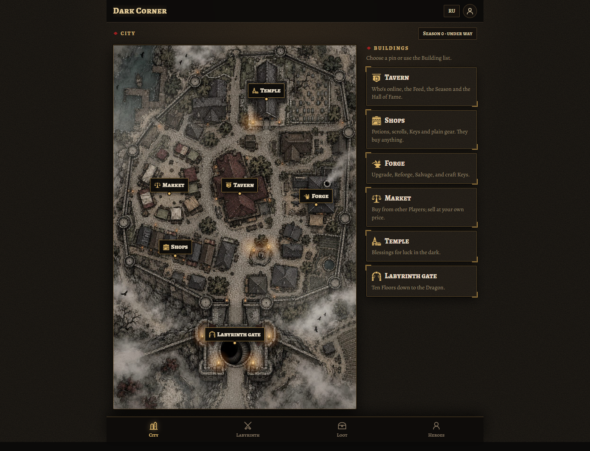
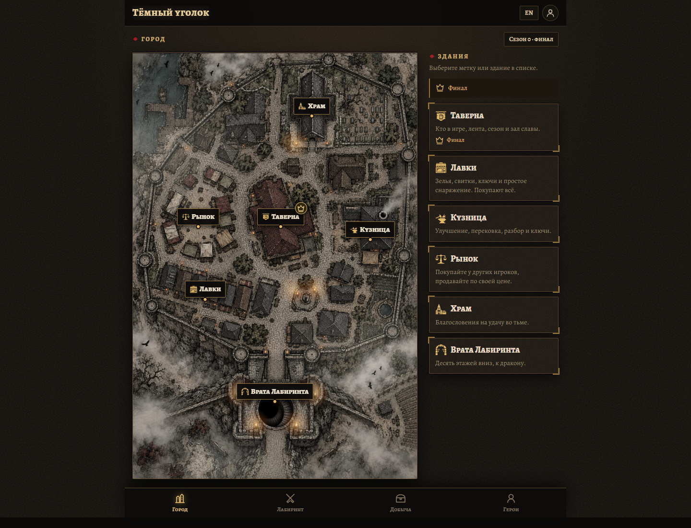

# City map review

Task: [codex-07-city-map](../../tasks/codex-07-city-map.md).

The City now uses the existing portrait map with six Building pins, torch flicker and drifting fog. Pins retain their normalized map coordinates as the image scales. The Building list stays below the map on phones and sits alongside it in the wider desktop layout.

The Tavern shows a flame while the active Season's Boss gate is open and a crown during the Finale. A planned Season locks the map's Labyrinth gate and its list entry, with an explanation. The screen reads the existing Tavern endpoint every 25 seconds; failed requests show a retry control. The map component accepts a `SeasonView` and is also available in the development sandbox with planned, active, gate-open, Finale and ended fixtures.

## Screenshots

Captured in headless Chrome with mocked authentication and Tavern responses. These show the actual City screen, not a separate mockup. Phone captures use a 375 × 812 viewport; desktop captures use 1440 × 1080. Screenshots freeze decorative animation.

| Phone: English, Boss gate open | Phone: Russian, planned |
|---|---|
|  |  |

## Validation

- `npm run typecheck`: passed across all workspaces.
- `npm run build`: passed for API and web.
- `git diff --check`: passed.
- Browser checks at 320, 375 and 1440 px: six non-overlapping targets, each at least 48 × 48 CSS px, contained within the map; no horizontal page overflow. Both English and Russian checked.
- All six routes activate with keyboard Enter. The planned gate stays on the City after pointer or keyboard activation, and its Building list entry cannot navigate.
- Flame/crown states, Finale precedence, and absence of badges before the Boss gate opens or after the Season ends checked.
- Advancing the browser clock across the gate opening and polling planned/Finale responses updates the map without a reload.
- Reduced motion disables both fog and torch animations.
- Failed Tavern response preserves usable map navigation; retry restores Season information.
- Sandbox state controls checked; no browser runtime errors.

To review manually, open `/sandbox` in development, switch among the City states, change language in the header, and enable reduced motion in the browser. On `/city`, the same component reads real Season data. Live backend integration was not exercised during the mocked browser checks.

## Branch dependency

`codex/city-map` extends `claude/icons-and-sounds`, which is one commit beyond `claude/week-5` and provides the `BUILDING_ICONS` contract named in the brief. No server, engine or shared-contract changes are part of this task.
